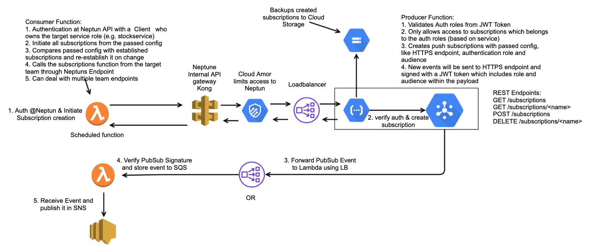
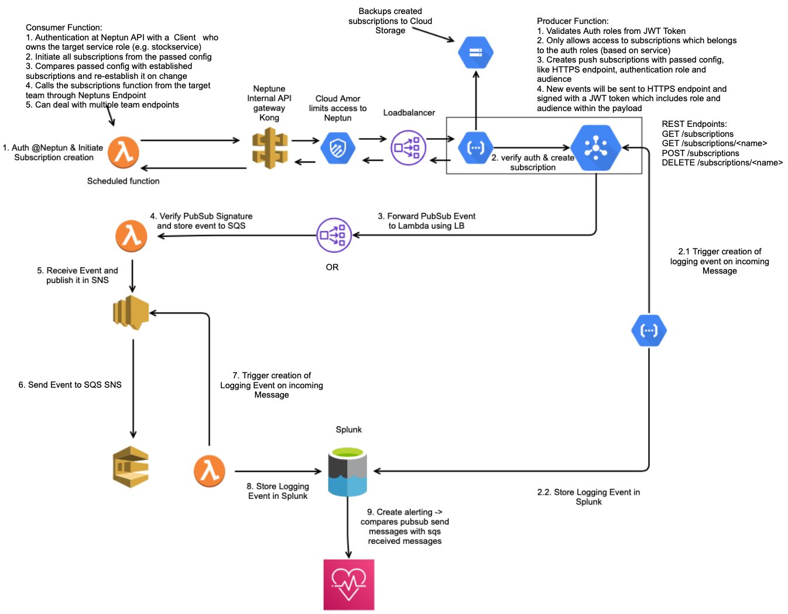

<!--
npm install
npm run reveal
-->

## Cross Cloud Auto-Subscriptions

### Managing topic subscriptions between GCP and AWS

---

## Taskforce Multicloud

evaluate solutions for cross-cloud communications to addresses the following core needs:

* Connection establishment
* Core Message transmission
* Monitoring and Alerting

> Result: 
> Cross-Cloud auto-subscriptions

---

## What is it?

> A solution to establish push subscriptions between the different clouds GCP <-> AWS in order to exchange events between different teams

----

## Why do we need this?

Current state in cross cloud setups:

1. producer is responsible for establishing subscriptions to consumers endpoints
2. The subscription is on the producer account and cannot be monitored by the consumer

Impact:

* producing team is responsible that consumers get events
* producing team is responsible for monitoring, alerting and informing the consuming team on failures

----

## Goals

Bringing the responsibility to the consumer, so that he can:

* initiate the subscription creation
* monitor the subscription
* trigger re-creation of removed subscription

Using central authorisation and authentication for data exchange:

* easy way to grant and revoke access
* central gateway for all endpoints
* authorization between producer and consumer

---

## The Core Architecture

----

## Including Monitoring

---

## The Subscription Format

<pre><code class="json">
{
  "topic": "it-ls-manta-warehousestock-nonlive-hlp-stockmovement-topic",
  "team": "manta",
  "service": "warehousestock",
  "options": {
    "pushConfig": {
      "pushEndpoint": "https://entrance.nonlive.oxpecker.platform.otto.de:8443/warehousestock/handler9",
      "oidcToken": {
          "serviceAccountEmail": "warehousestock-pipeline-role@gcp-it-ls-manta-nonlive-hlp.iam.gserviceaccount.com",
          "audience": "myaudience"
      }
    },
    "deadLetterPolicy": {
      "deadLetterTopic": "projects/gcp-it-ls-manta-nonlive-hlp/topics/warehousestock-deadletter",
      "maxDeliveryAttempts": "10"
    },
    "ackDeadlineSeconds": "30",
    "retainAckedMessages": "true",
    "messageRetentionDuration": {
      "seconds": "86400"
    },
    "expirationPolicy": {
      "ttl": {
        "seconds": "86400"
      }
    },
    "retryPolicy": {
      "minimumBackoff": {
        "seconds": "300"
      },
      "maximumBackoff": {
        "seconds": "300"
      }
    }
  }
}
</code></pre>

---