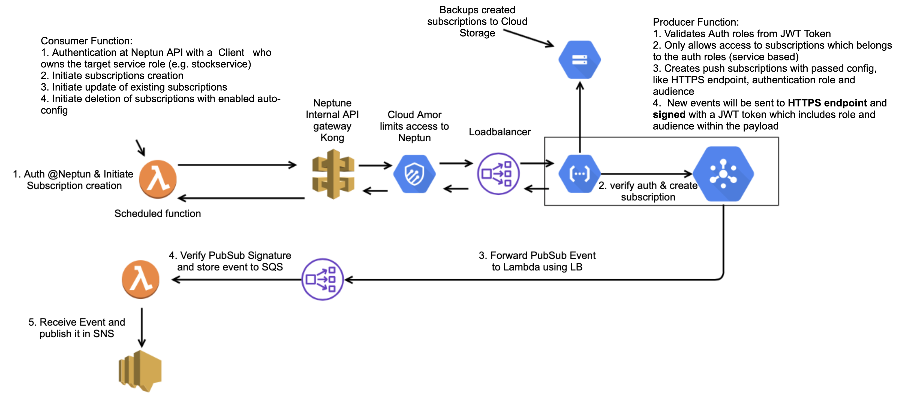

<!--
npm install
npm run reveal
-->

## Cross Cloud Auto-Subscriptions

### Managing topic subscriptions between GCP and AWS

---

## How it started... 

Taskforce Multicloud to address the following cross-cloud core needs:

* Connection establishment
* Core Message transmission
* Monitoring and Alerting

> 1st Solution: 
> Cross-Cloud auto-subscriptions

---

## What is it?

> A solution to <b>automatically</b> establish push subscriptions between the different clouds <b>GCP & AWS</b>
> in order to exchange events between different teams and services

----

## Why do we need this?

Current cross cloud setups:

1. consumer has to request subscriptions from producer
2. producer is responsible for establishing subscriptions
3. The subscription <b>MUST</b> be monitored by the producer

Impact:

* producing team is responsible that consumers get events
* producing team is responsible for monitoring, alerting and informing the consuming team on failures

----

## Team Values

<h3>Bringing the responsibility to the consumer</h3>

Enable the consumer to:

* update or create the subscription for multiple teams
* use a central config for all subscriptions
* delete subscriptions
* monitor subscriptions
* automatically re-create removed subscriptions

----

## Overarching Values

<h3>Using central authorisation and authentication</h3>

Enables the teams to:

* easily grant and revoke access to subscriptions
* use Neptuns role based access model
* use a central gateway for the endpoints of all teams
* secure communication between producer <> consumer

---

## Design

----

## The Core Architecture

----

## Including Monitoring

---

## Subscriptions Configuration

<pre style="font-size:13px"><code class="json">{
  "subscriptions": [
    {
      "neptun_subscriptions_path": "/v1/manta/subscriptions",
      "topic": "it-ls-manta-warehousestock-nonlive-hlp-stockmovement-topic",
      "team": "manta",
      "identifier": "001",
      "service": "warehousestock",
      "options": {
        "pushConfig": {
          "pushEndpoint": "https://entrance.nonlive.oxpecker.platform.otto.de:8443/warehousestock/handler",
          "oidcToken": {
            "serviceAccountEmail": "warehousestock-pipeline-role@gcp-it-ls-manta-nonlive-hlp.iam.gserviceaccount.com",
            "audience": "myaudience"
          }
        },
        "deadLetterPolicy": {
          "deadLetterTopic": "projects/gcp-it-ls-manta-nonlive-hlp/topics/warehousestock-deadletter",
          "maxDeliveryAttempts": "10"
        },
        "ackDeadlineSeconds": "30",
        "messageRetentionDuration": {
          "seconds": "86400"
        },
        "retryPolicy": {
          "minimumBackoff": {
            "seconds": "300"
          },
          "maximumBackoff": {
            "seconds": "300"
          }
        }
      }
    }
  ]
}
</code></pre>

----

## Auto-Configure Services

<pre style="font-size:13px"><code class="json">[
  {
    "path" : "/v1/manta/subscriptions",
    "services" : [
      "stockservice",
      "warehousestock"
    ]
  },
]
</code></pre>
---

## Show-Time

